# {MAIN_REPO_NAME}

<div align="center">
  
</div>

<div align="center">

## 🎓 {COURSE_NAME} Research Projects

  

</div>

---

## 🔬 Research Areas

<div align="center">
  
</div>

<div align="center">

### 🌟 Interactive Research Ecosystem

```mermaid
graph TB
    A[🧠 AI Research Hub] --> B[👁️ Computer Vision]
    A --> C[💬 Natural Language Processing]
    A --> D[🔗 Graph Neural Networks]
    A --> E[🏥 Healthcare AI]
    A --> F[🤖 Federated Learning]
    
    B --> B1[3D Scene Understanding]
    B --> B2[Object Detection]
    B --> B3[Neural Radiance Fields]
    
    C --> C1[Text Generation]
    C --> C2[Speech Recognition]
    C --> C3[Question Answering]
    
    D --> D1[Knowledge Graphs]
    D --> D2[Molecular Property]
    D --> D3[Citation Networks]
    
    E --> E1[Medical Imaging]
    E --> E2[Brain-Computer Interface]
    E --> E3[Medical Segmentation]
    
    F --> F1[Horizontal FL]
    F --> F2[Edge Computing]
    F --> F3[Privacy Preservation]

    style A fill:#ff9999,stroke:#333,stroke-width:3px
    style B fill:#66b3ff,stroke:#333,stroke-width:2px
    style C fill:#99ff99,stroke:#333,stroke-width:2px
    style D fill:#ffcc99,stroke:#333,stroke-width:2px
    style E fill:#ff99cc,stroke:#333,stroke-width:2px
    style F fill:#ccccff,stroke:#333,stroke-width:2px
```

<details>
<summary><b>🎮 Click to Explore Research Domains</b></summary>
<br>



</details>

</div>

---

## 📊 Main Research Domains

<div align="center">

| 🤖 **AI Systems** | 👁️ **Computer Vision** | 💬 **NLP & Speech** | 🔗 **Graph Networks** | 🏥 **Healthcare AI** |
|:---:|:---:|:---:|:---:|:---:|
|  |  |  |  |  |
| **Impact:** ⭐⭐⭐⭐⭐ | **Impact:** ⭐⭐⭐⭐⭐ | **Impact:** ⭐⭐⭐⭐⭐ | **Impact:** ⭐⭐⭐⭐ | **Impact:** ⭐⭐⭐⭐⭐ |
| **Projects:** `15` | **Projects:** `12` | **Projects:** `18` | **Projects:** `8` | **Projects:** `9` |
| <sub>*Cutting-edge autonomous systems and distributed learning*</sub> | <sub>*Advanced 3D understanding and object recognition*</sub> | <sub>*Next-gen language models and speech synthesis*</sub> | <sub>*Complex network analysis and molecular prediction*</sub> | <sub>*AI-powered medical diagnostics and interfaces*</sub> |

</div>

---

## 📈 Research Analytics Command Center

<div align="center">
  
</div>

### 📅 Project Timeline

<div align="center">

| **Week** | **Phase** | **Milestone** | **Progress** | **Status** |
|:--------:|:---------:|:--------------|:------------:|:----------:|
| **1-3** | 🔍 | Literature Review & Research Proposal |  | ✅ **Complete** |
| **4-6** | 🧪 | Methodology Development & Validation |  | 🔄 **In Progress** |
| **7-10** | ⚡ | Solution Implementation & Testing |  | 🚀 **Started** |
| **11-13** | 🔬 | Experimentation & Analysis |  | ⏳ **Pending** |
| **14-16** | 📝 | Documentation & Presentation |  | ⏳ **Pending** |

</div>

---

## 🧭 Interactive Navigation Hub

<div align="center">
  
</div>

<div align="center">

<table>
<tr>
<td align="center" width="33%">

<details>
<summary>

</summary>

### 📚 Student Workflow
- **🏁 Start:** Navigate to `projects/[YOUR-INDEX]-[YOUR-AREA]/`
- **📖 Read:** Guidelines in `docs/project_guidelines.md`
- **✍️ Write:** Research proposal in `docs/research_proposal.md`
- **📊 Track:** Progress using GitHub Issues
- **💻 Commit:** Regular updates expected
- **💬 Communicate:** Weekly supervisor check-ins

</details>

</td>
<td align="center" width="33%">

<details>
<summary>

</summary>

### 🔍 Supervision Dashboard
- **📋 Guide:** Access `docs/supervisor_guide.md`
- **📊 Monitor:** Student progress via Issues
- **📈 Track:** GitHub Projects overview
- **💬 Engage:** Issue comment discussions
- **📅 Schedule:** Weekly progress reviews

</details>

</td>
<td align="center" width="33%">

<details>
<summary>

</summary>

### 🛠️ Quick Resources
- **📁 [Projects](./projects/)** - Student work folders
- **📚 [Docs](./docs/)** - Course documentation  
- **📋 [Templates](./templates/)** - Project templates
- **❓ [Issues](../../issues)** - Support & tracking
- **💬 [Discussions](../../discussions)** - Q&A forum

</details>

</td>
</tr>
</table>

</div>

---

## 🏆 Research Excellence Metrics

<div align="center">
  
</div>

<div align="center">

### 🎯 Key Performance Indicators


</div>

### 📊 Research Activity Heatmap

<div align="center">

```
🔥 Research Areas Activity Distribution:
████████████████████████████████████████ NLP & Language Understanding (18 projects)
███████████████████████████████████░░░░░ Computer Vision & 3D Systems (15 projects)  
██████████████████████████████░░░░░░░░░░ Healthcare AI & Medical Tech (12 projects)
████████████████████████░░░░░░░░░░░░░░░░ Graph Neural Networks (9 projects)
██████████████████████░░░░░░░░░░░░░░░░░░ Federated & Edge Learning (8 projects)
```

</div>

<div align="center">
  
</div>

---

## 🤝 Support & Communication Hub

<div align="center">
  
</div>

<div align="center">

### 📞 Smart Contact System

</div>

| **Support Channel** | **Access Method** | **Response SLA** | **Best For** |
|:-------------------:|:-----------------:|:----------------:|:------------:|
| 🐛 **Technical Issues** | [](../../issues/new?template=support.md) | `< 24h` | Bugs, Repository Problems |
| 🎓 **Academic Support** | [](mailto:supervisor@university.edu) | `< 48h` | Research Questions |
| 💬 **General Help** | [](../../discussions) | `< 12h` | General Inquiries |
| 🚨 **Urgent Matters** | [](https://university-research.slack.com) | `< 4h` | Critical Issues |

<div align="center">

<details>
<summary>🏗️ <b>Repository Architecture</b></summary>
<br>

```
📁 {MAIN_REPO_NAME}/
├── 📂 projects/                    # Individual student project folders
│   ├── 📁 [INDEX]-[RESEARCH-AREA]/
│   │   ├── 📄 README.md           # Student project overview
│   │   ├── 📂 docs/               # Documentation and reports
│   │   ├── 📂 src/                # Source code
│   │   ├── 📂 data/               # Datasets
│   │   ├── 📂 experiments/        # Experiment results
│   │   └── 📂 results/            # Final results
├── 📂 docs/                       # Course documentation
│   ├── 📄 project_overview.md     # Project overview and requirements
│   ├── 📄 project_guidelines.md   # Guidelines for students
│   └── 📄 supervisor_guide.md     # Guide for supervisors
├── 📂 templates/                  # Templates for students
└── 📄 README.md                   # This file
```

</details>

</div>

---

<div align="center">
  
  
  <sub><i>🏛️ Managed by the Department of Computer Science & Engineering</i></sub>
  
  
  
  
  
</div>
